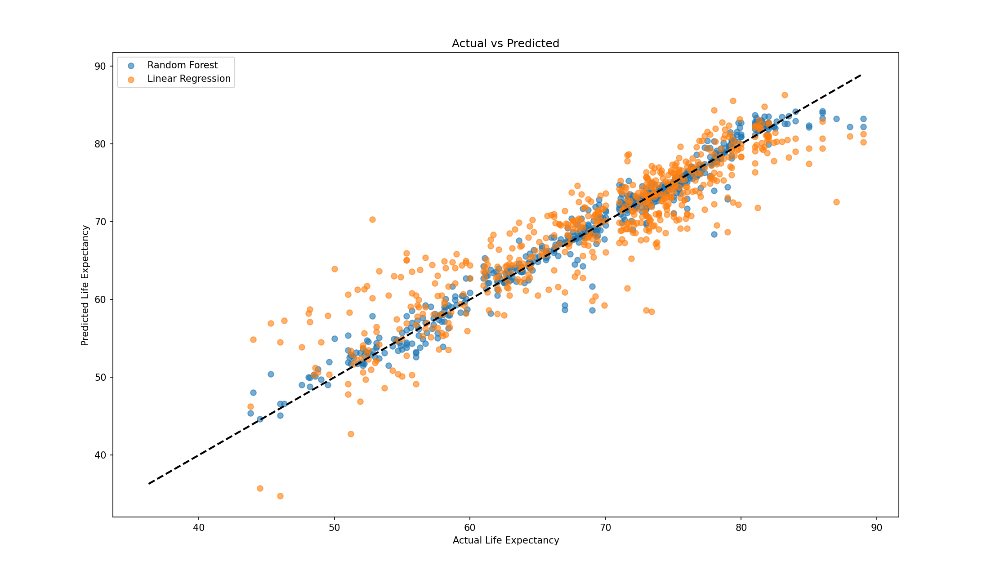

## Life Expectancy Analysis and Prediction

### Overview

This project analyzes global life expectancy data using machine learning techniques to identify key factors that influence life expectancy across different countries and years. The analysis includes comprehensive data preprocessing, exploratory data analysis, feature engineering, and predictive modeling.

### Visualizations Generated

Life Expectancy Distribution: Histogram with KDE curve  

Correlation Heatmap: Complete feature correlation matrix  

GDP Outlier Detection: Box plot showing economic disparities  

GDP vs Life Expectancy: Scatter plot with regression line  

Feature Relationships: Comprehensive pair plot matrix  

Residual Analysis: Distribution using Linear regression  

Feature Importance: Random Forest feature ranking  

Model Comparison: Actual vs Predicted scatter plots  

### Dataset

Source: Life expectancy dataset with health, economic, and social indicators
Size: Multiple countries across different years
Features: 20+ variables including GDP, schooling, mortality rates, disease indicators, and more

### Key Findings:

HIV/AIDS (Random Forest importance: ~0.60) - Strongest individual predictor
Adult Mortality (Correlation: -0.70) - Strong negative relationship
Schooling (Correlation: 0.72) - Education strongly predicts longevity
Income Composition (Correlation: 0.69) - Economic development indicator

### Installation & Usage

#### Prerequisites
bashpip install pandas numpy seaborn matplotlib scikit-learn
Running the Analysis
bashpython life_expectancy_analysis.py
Expected Outputs

Multiple visualization plots
Model performance metrics printed to console
Feature importance rankings
Residual analysis results

#### Dependencies

pandas: Data manipulation and analysis
numpy: Numerical computations
seaborn: Statistical data visualization
matplotlib: Plotting and visualization
scikit-learn: Machine learning algorithms and preprocessing

### Key Takeaways for Public Health

Education Investment: Schooling shows strong positive impact on life expectancy
Disease Prevention: HIV/AIDS prevention programs are crucial
Healthcare Access: Adult mortality reduction should be prioritized
Economic Development: GDP growth correlates with health outcomes
Immunization Programs: Vaccination coverage significantly impacts longevity
